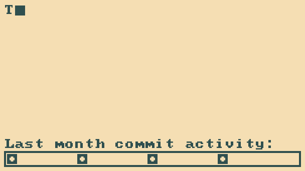

## Hi there 👋
I am just here to stay. 
If anybody reads this in 2100+,  
maybe you might have heared about Java or C++, 
but surely you neved heared 'bout Rust.

<!--
**TeaTiMe08/TeaTiMe08** is a ✨ _special_ ✨ repository because its `README.md` (this file) appears on your GitHub profile.

Here are some ideas to get you started:

- 🔭 I’m currently working on ...
- 🌱 I’m currently learning ...
- 👯 I’m looking to collaborate on ...
- 🤔 I’m looking for help with ...
- 💬 Ask me about ...
- 📫 How to reach me: ...
- 😄 Pronouns: ...
- ⚡ Fun fact: ...
-->
